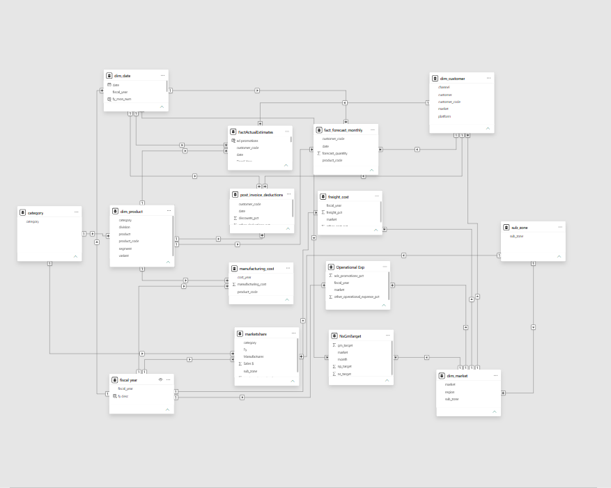
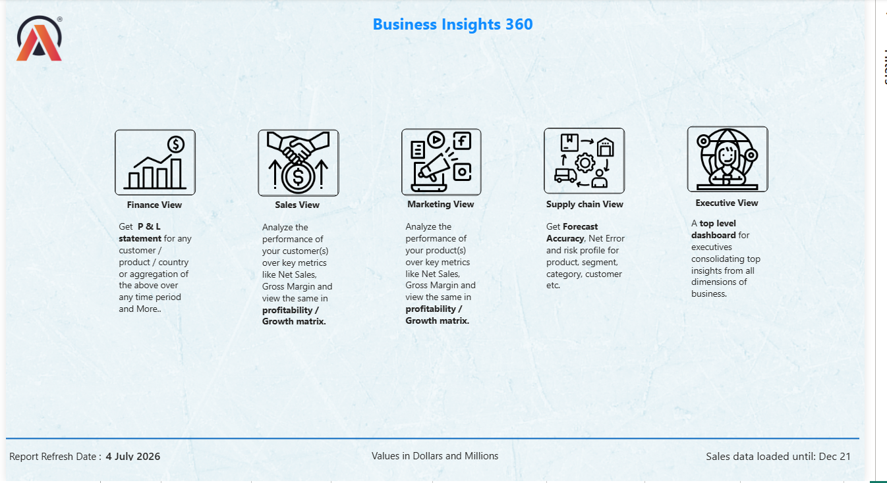
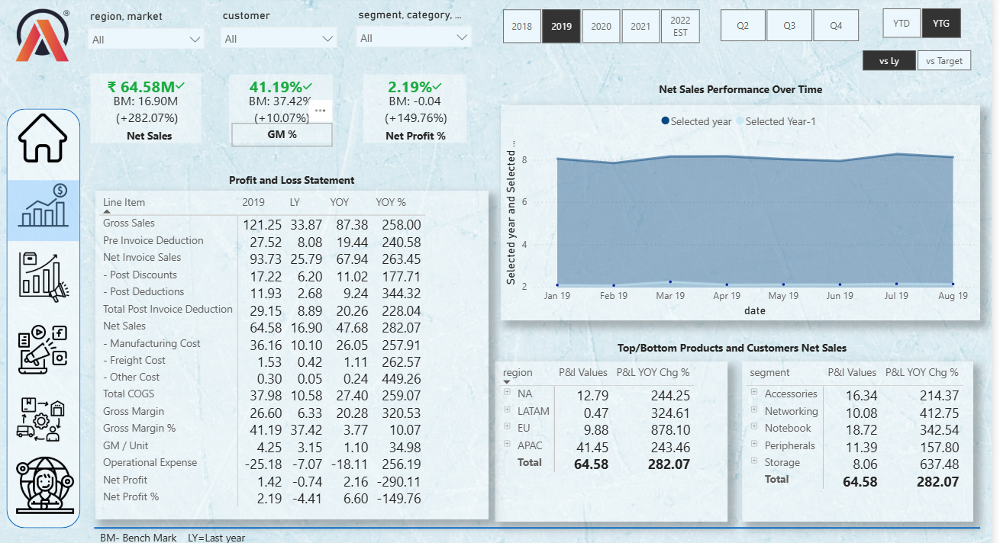
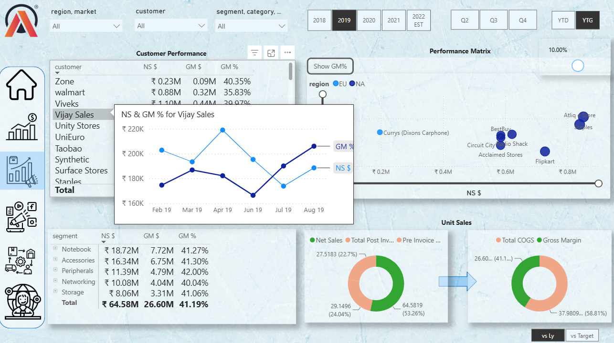
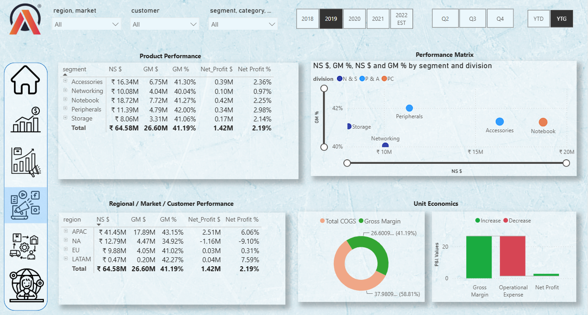
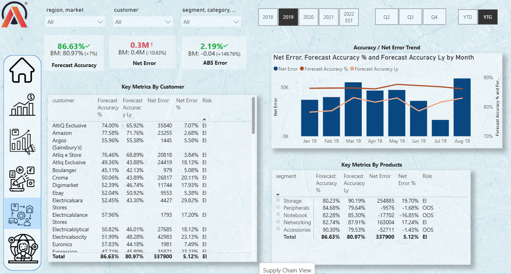
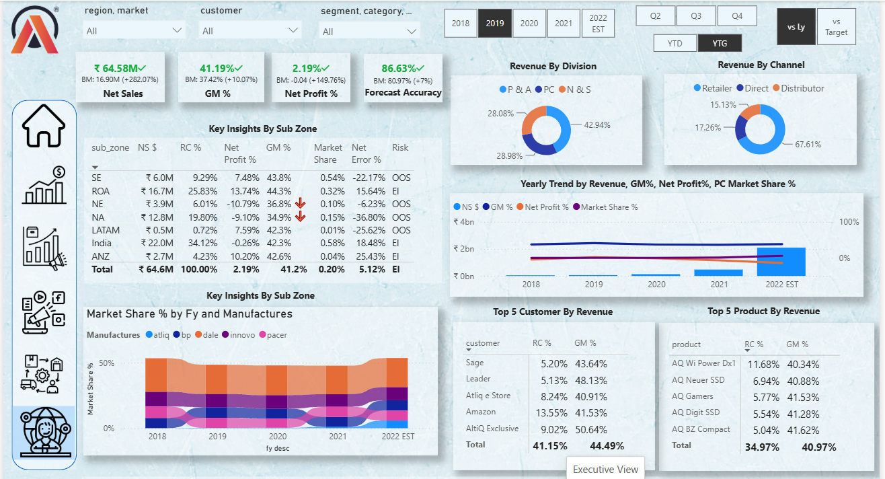

# Business Insights 360 - Power BI Dashboard

An enterprise analytics solution showcasing multi-dimensional BI capabilities across Finance, Sales, Marketing, Supply Chain, and Executive reporting.

## 🎯 Quick Overview

**Tech Stack:** Power BI | MySQL | DAX | Star & Snowflake Schema  
**Key Metrics:** Net Sales | Gross Margin | Net Profit %| Forecast Accuracy 

---

## 📊 Dashboard Views

| View | Focus | Key Features |
|------|-------|--------------|
| **Finance** | P&L Analysis | Net Sales, COGS, Gross Margin, Operational Expense, Net Profit tracking with YoY comparisons |
| **Sales** | Customer Performance | Customer matrix, a scatter plot of net sales and gross margin per customer, segment-wise product analysis |
| **Marketing** | Product & Regional Analysis | Product performance matrix, waterfall profit analysis, regional breakdown |
| **Supply Chain** | Forecast Accuracy & Risk | Monthly forecast trends, net error tracking, inventory risk assessment (OOS/EI status) |
| **Executive** | Consolidated KPIs | Revenue by division/channel, top 5 customers/products, market share trends, sub-zone performance |

---

## 🛠️ Technical Skills Demonstrated

### Data Modeling
- ✅ Star & Snowflake hybrid schema design
- ✅ Custom date dimension with fiscal calendar
- ✅ Optimized fact tables for performance

### DAX Expertise
**Core Measures Used:**
- `CALCULATE` - Context modification & filtering
- `SUMX`, `SUM` - Aggregations
- `DIVIDE` - Safe division with error handling
- `SAMEPERIODLASTYEAR` - YoY comparisons
- `FILTER` - Conditional filtering
- `SELECTEDVALUE`, `HASVALUE` - Context checks
- `IF`, `SWITCH` - Conditional logic
- `ISCROSSFILTERED`, `ISFILTERED` - Dynamic filtering

**Advanced Patterns:**
- Time intelligence (YTD, YoY, growth calculations)
- Conditional risk assessment
- Dynamic benchmarking against targets
- Context-aware KPI calculations

### Database & Query Optimization
- Power Query for data transformation
- Performance-optimized DAX measures

### Power BI Visualizations
- Matrix tables with drill-down
- Dynamic line & column charts
- Scatter plots with benchmarking
- Waterfall & ribbon charts
- KPI cards with variance tracking
- Donut charts for composition analysis
- Toggle buttons for metric switching

---

## 📈 Key Deliverables

✅ **5 Interactive Views** - Each designed for specific stakeholder needs  
✅ **DAX Measures** - Financial, supply chain, and time intelligence metrics  
✅ **Cross-filtering Dashboard** - Slicers: Region, Market, Customer, Segment, Fiscal Year  
✅ **Advanced Analytics** - Forecast accuracy, margin analysis, competitive benchmarking  
✅ **Real-time KPIs** - Net Sales, Gross Margin%, Net Profit%, Forecast Accuracy  

---

## 💡 Domain Knowledge

- **Financial Reporting:** P&L statement construction, cost analysis, margin decomposition
- **Supply Chain Analytics:** Forecast accuracy modeling, inventory risk assessment, demand planning
- **Sales Analytics:** Customer segmentation, performance matrix analysis, channel wise performance
- **Market Analysis:** Competitive market share tracking, regional performance, customer profitability

---
## 📊 Screenshots

### Data Model Architecture

### Home View 

### Finance View - P&L Statement

### Sales View - Customer Performance

### Marketing View - Product Analysis

### Supply Chain View - Forecast Accuracy

### Executive View - KPIs & Market Share

---
## 🎓 Skills Highlighted

- ✅ Advanced DAX
- ✅ Database Design (Star Schema)
- ✅ Data Modeling & Transformation
- ✅ ETL
- ✅ Interactive Dashboard Design
- ✅ Business Intelligence & Analytics
- ✅ Financial & Supply Chain Analytics
- ✅ Performance Optimization
